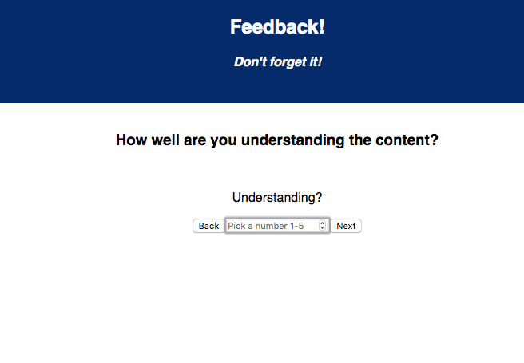
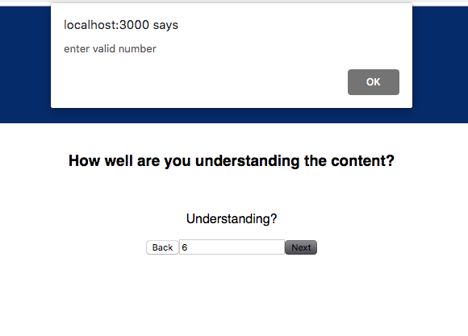
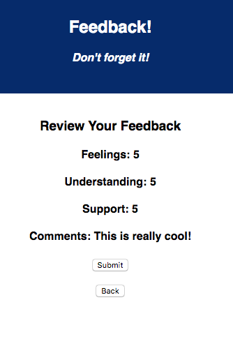

# Redux Feedback Loop

## Description
Duration: 2 days

A feedback form is an easy way to get insight on how likely a user may repeat using your service. I come across feedback surveys on YouTube before a video, and on subscription based education sights when either completing a course, or canceling subscription. This project will give you insight on how to create a simple multi page feedback form, where the user is required to provide input before moving to the next page, giving them the option to change input, and reviewing all input provided before submitting the form.

I will show you how to separate each feedback question into separate pages while iterating new data with each new input. We want to make it a requirement that the user adds feedback by selecting a number 1-5, the option to go back and change that input, option to add a comment, and then be taken back to the beginning where they can start the process over again. I can solve that with input validation, a button that will take them to the next  page, a button that will take them to the previous page, and a submit button that will send that data to a server that will store it in a database.

To see this site in action you can visit http://localhost:3000/#/, but only after some additional setup.

## Screen Shot

<<<<<<< HEAD
=======
.
.
.

>>>>>>> 0a5778c0c4e34925fdde887215b406a63da35fb6
Additional README details can be found [here](https://github.com/PrimeAcademy/github-finalization-assignment).
